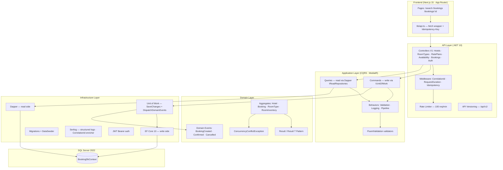

# Hotel Booking Platform

A production-quality hotel booking REST API built with **.NET 10**, Next.js 15, SQL Server, Docker and Clean Architecture — developed as a senior technical assessment.

---

## Architecture



---

## Key Design Decisions

### Concurrency Control — RowVersion (Optimistic Locking)
`RoomInventory` has a `byte[] RowVersion` column mapped as `[Timestamp]`. When two concurrent requests try to decrement the same inventory row, EF Core throws `DbUpdateConcurrencyException`. The `UnitOfWork` catches it and rethrows as a domain-level `ConcurrencyConflictException`, which the `CreateBookingCommandHandler` maps to `Result.Failure("INVENTORY_CONFLICT")` → HTTP 409.

This avoids pessimistic locking overhead while ensuring no overbooking under concurrent load.

### Idempotency
A middleware layer (`IdempotencyMiddleware`) intercepts all POST/PUT requests bearing an `Idempotency-Key` header. It:
1. Looks up `IdempotencyRecord` in the DB by key hash
2. If found, replays the cached response body + status code + `X-Idempotency-Replayed: true` header
3. If not found, buffers the outgoing response, stores it, then forwards

This guarantees safe retry semantics at the HTTP layer — no MediatR-level complexity required.

### CQRS with Dapper reads
All queries bypass EF Core entirely and use raw SQL via Dapper + `IDbConnection`. This keeps reads fast (no change tracking) and lets SQL be tuned directly (e.g., CTE-based availability query with `COUNT(*) OVER()` pagination).

### Result Pattern
No exceptions as flow control. All domain operations return `Result` or `Result<T>` with an `ErrorCode` string. The `ResultExtensions.ToActionResult()` maps error codes to HTTP status codes:
- `NOT_FOUND` → 404
- `VALIDATION_ERROR` → 400
- `INVENTORY_CONFLICT` → 409
- `BOOKING_INVALID_STATE`, `CAPACITY_EXCEEDED` → 422
- `INVENTORY_INSUFFICIENT` → 409

---

## Quick Start

### Option 1 — Docker (recommended)

```bash
git clone <repo>
cd hotelBookingPlatform
docker-compose up --build
```

Services started:
| Service    | URL                           |
|------------|-------------------------------|
| API        | http://localhost:5000         |
| Swagger    | http://localhost:5000/swagger |
| Frontend   | http://localhost:3000         |
| SQL Server | localhost:1433                |

The API automatically applies EF migrations and seeds data on first run.

### Option 2 — Local development

**Prerequisites:** .NET 10 SDK, Node.js 22+, SQL Server (or Docker for SQL only)

```bash
# Run SQL Server only
docker run -e SA_PASSWORD=HBP_StrongPass123! -e ACCEPT_EULA=Y -p 1433:1433 \
  mcr.microsoft.com/mssql/server:2022-latest

# Run API
cd src/HotelBookingPlatform.Api
dotnet run

# Run Frontend (separate terminal)
cd frontend
npm install
npm run dev
```

---

## Running Tests

```bash
# Unit tests only (no Docker required)
dotnet test tests/HotelBookingPlatform.UnitTests --logger "console;verbosity=normal"

# Integration tests (requires Docker daemon for Testcontainers)
dotnet test tests/HotelBookingPlatform.IntegrationTests --logger "console;verbosity=normal"

# All tests
dotnet test
```

**Unit tests (17):**
- `ResultPatternTests` — Result/Result\<T\> success and failure paths
- `BookingStatusTests` — state machine transitions + domain events
- `RatePlanPriceTests` — price calculation, inactive plan, date out of range
- `RoomInventoryTests` — decrease/increase with boundary checks

**Integration tests (3, Testcontainers MsSql):**
- `CreateBooking_WithValidRequest_ShouldReturn201` — full happy path
- `CreateBooking_SameIdempotencyKey_ShouldReturnSameResponse` — idempotency replay
- `ConcurrencyTest_TenSimultaneousRequests_OnlyOneShouldSucceed` — overbooking prevention

---

## API Reference

Base URL: `http://localhost:5000/api/v1`

### Authentication
```
POST /auth/token
Body: { "username": "admin", "password": "Admin123!" }
```

### Hotels
```
GET    /hotels?pageNumber=1&pageSize=10&sortBy=Name&sortDirection=asc
GET    /hotels/{id}
POST   /hotels                               [Authorize]
PUT    /hotels/{id}                          [Authorize]
DELETE /hotels/{id}                          [Authorize]
```

### Room Types
```
GET    /hotels/{hotelId}/room-types
POST   /hotels/{hotelId}/room-types          [Authorize]
PUT    /hotels/{hotelId}/room-types/{id}     [Authorize]
DELETE /hotels/{hotelId}/room-types/{id}     [Authorize]
```

### Rate Plans
```
GET    /rate-plans?roomTypeId={id}
GET    /rate-plans/calculate-price?roomTypeId={id}&checkIn=YYYY-MM-DD&checkOut=YYYY-MM-DD
POST   /rate-plans                           [Authorize]
PUT    /rate-plans/{id}                      [Authorize]
DELETE /rate-plans/{id}                      [Authorize]
```

### Availability
```
GET    /availability?hotelId={id}&checkIn=YYYY-MM-DD&checkOut=YYYY-MM-DD&guests=2
```

### Bookings
```
POST   /bookings          Idempotency-Key: <uuid>  (header required)
GET    /bookings?pageNumber=1&pageSize=10&status=Pending
GET    /bookings/{id}
PUT    /bookings/{id}/confirm                [Authorize]
PUT    /bookings/{id}/cancel                 [Authorize]
```

---

## Example curl Commands

**Search availability:**
```bash
curl "http://localhost:5000/api/v1/availability?checkIn=2026-06-01&checkOut=2026-06-05&guests=2"
```

**Create a booking (idempotent):**
```bash
curl -X POST http://localhost:5000/api/v1/bookings \
  -H "Content-Type: application/json" \
  -H "Idempotency-Key: $(uuidgen)" \
  -d '{
    "roomTypeId": "<roomTypeId>",
    "checkIn": "2026-06-01",
    "checkOut": "2026-06-05",
    "guestCount": 2,
    "guestFirstName": "John",
    "guestLastName": "Doe",
    "guestEmail": "john@example.com",
    "guestPhone": "+50312345678"
  }'
```

**Get a JWT token:**
```bash
curl -X POST http://localhost:5000/api/v1/auth/token \
  -H "Content-Type: application/json" \
  -d '{"username":"admin","password":"Admin123!"}'
```

---

## Project Structure

```
hotelBookingPlatform/
├── src/
│   ├── HotelBookingPlatform.Domain/           # Entities, Result, Events, Interfaces
│   ├── HotelBookingPlatform.Application/      # CQRS handlers, validators, behaviors
│   ├── HotelBookingPlatform.Infrastructure/   # EF Core, Dapper, UoW, seed
│   └── HotelBookingPlatform.Api/              # Middleware, controllers, Program.cs
├── tests/
│   ├── HotelBookingPlatform.UnitTests/        # 17 unit tests (no DB)
│   └── HotelBookingPlatform.IntegrationTests/ # 3 integration tests (Testcontainers)
├── frontend/                                  # Next.js 15 App Router
│   ├── app/search/                            # Availability search + booking modal
│   ├── app/bookings/                          # Paginated bookings list
│   └── app/bookings/[id]/                     # Booking detail + confirm/cancel
├── postman/                                   # Postman collection
├── Dockerfile.api                             # Multi-stage .NET 10 build
└── docker-compose.yml                         # sqlserver + api + frontend
```

---

## Seed Data

On first run the API seeds:
- **2 hotels** (Grand Plaza, Boutique Central) in San Salvador
- **3 room types per hotel** (Standard, Deluxe, Suite)
- **Room inventory** for 30 days at 10 rooms/day per type
- **Rate plans** active for 90 days
- **5 sample bookings** in Pending/Confirmed states

---

## Environment Variables

| Variable                     | Default                             | Description                  |
|------------------------------|-------------------------------------|------------------------------|
| `ConnectionStrings__Default` | set by docker-compose               | SQL Server connection string  |
| `Jwt__Key`                   | `SuperSecretKeyForDemoOnly32Chars!` | JWT signing key (change this) |
| `Jwt__Issuer`                | `HotelBookingPlatform`              | JWT issuer                   |
| `Jwt__ExpiryMinutes`         | `60`                                | Token lifetime in minutes    |
| `Booking__MaxNights`         | `30`                                | Maximum booking duration     |
| `NEXT_PUBLIC_API_URL`        | `http://localhost:5000`             | API base URL for frontend    |

---

## Postman Collection

Import `postman/HotelBookingPlatform.postman_collection.json`.

Features:
- Auto-generates `Idempotency-Key` UUID in pre-request scripts on all booking POST requests
- Captures `hotelId`, `roomTypeId`, `bookingId` into collection variables automatically
- Fixed-key idempotency test request to verify replay behavior (`X-Idempotency-Replayed: true`)
- JWT token auto-saved to `{{token}}` on login

**Recommended run order:** Auth → Hotels → Room Types → Rate Plans → Availability → Bookings
